# Agent Access Token

To allow the flexibility of using an agent without requiring the user to be authenticated using Entra ID credentials, you can create an **Agent Access Token**. This is particularly useful for public applications that want to provide access to the agent without requiring users to log in with their Entra ID credentials.

## How to create an Agent Access Token

1. In the **Security** section of the agent configuration, click on the **Create Access Token** button to create a new access token.
   
   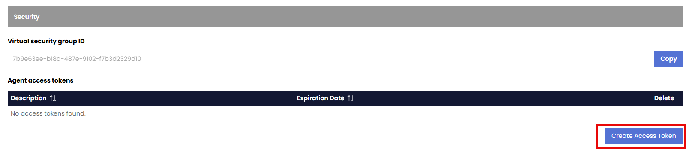

2. In the **Create Access Token** dialog, enter a description for the access token and an expiration date then click on the **Create Access Token** button.
   
   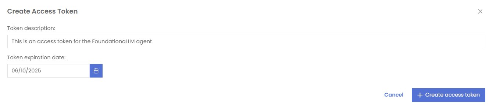

3. The access token will be created and displayed in a dialog, make sure to save it or copy it for future use.
   
   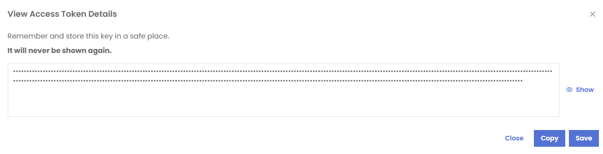

## Assigning permission to the new Virtual Security Group ID of the agent

1. Copy the GUID of the new Virtual Security Group ID of the agent.

   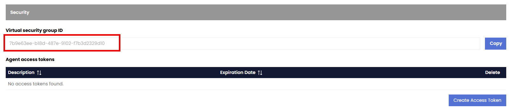

2. At the top of the page while editing the agent, click on the **Access Control**.
   
   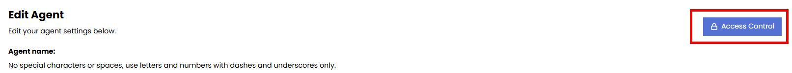

3. In the **Access Control** page, click on the **Add Role Assignment for this resource** button.
4. Verify that the Scope is set to `providers/FoundationaLLM.Agent/agents/{agent_name}`.
5. Choose **Group** as the Prinicipal Type.
6. Paste the GUID of the new Virtual Security Group ID of the agent in the **Principal ID** field.
7. Choose **Reader** as the Role to assign.

    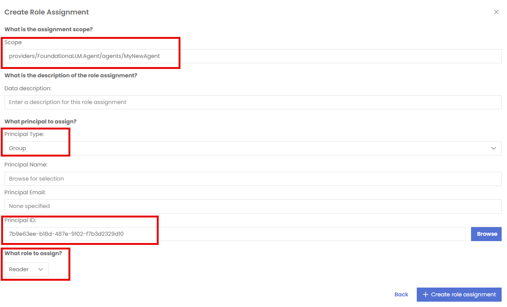

## Accessing the agent using the Agent Access Token

To share an example of how to use the Agent Access Token, we will use the API collection from **POSTMAN** that is publicly available and part of the FoundationaLLM documentation.

There are two steps required to use the agent using the Agent Access Token in **POSTMAN** by accessing the **FoundationaLLM.Core.API** collection:
1. Under **sessions**, pick the POST **Creates a new Chat session with Agent Access Token**
2. Under **completions**, expand **completion** and pick POST **Requests a completion with Agent Access Token**

    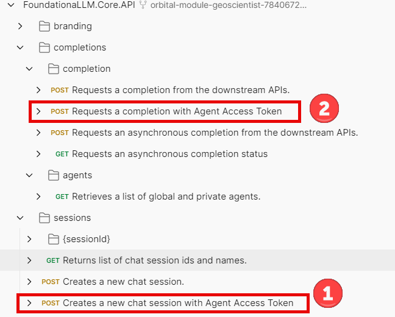

You have to start with the **Creates a new Chat session with Agent Access Token** request to create a new chat session as the request for completion requires a **sessionId**. 

1. Start by setting the **Authorization** type to `No Auth`

    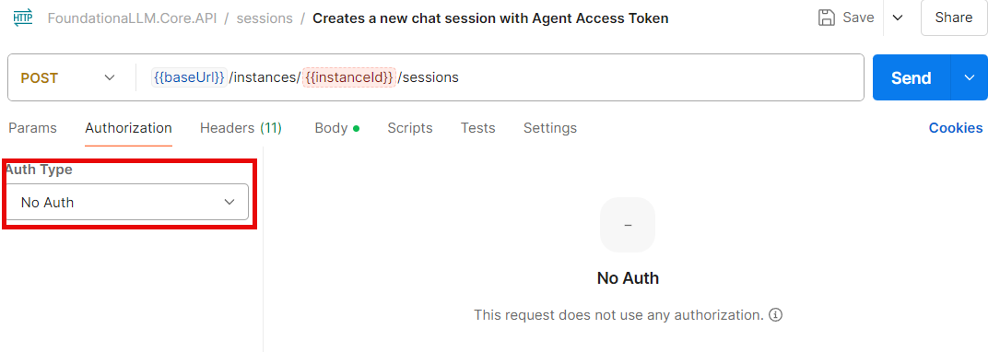

2. On the Headers tab, set a new key **X-AGENT-ACCESS-TOKEN** with the value of the Access Token that you were asked to save or copy previously

    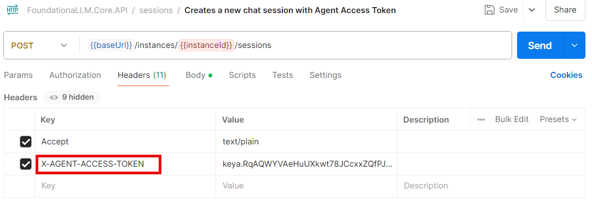

3. On the Body tab, enter a name for your chat conversation session in the **name** key in raw JSON format

    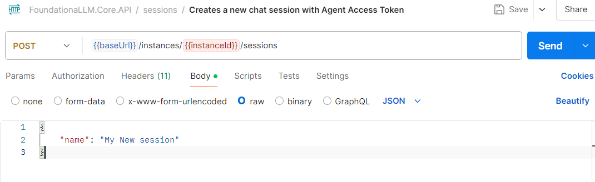

4. Click on the **Send** button to send the request and save the **sessionId** from the response as it will be needed in the next step.

The next step is to POST to the completion endpoint to get a response from the agent utilizing the sessionId received in the previous step.

1- Set the **Authorization** type to `No Auth`

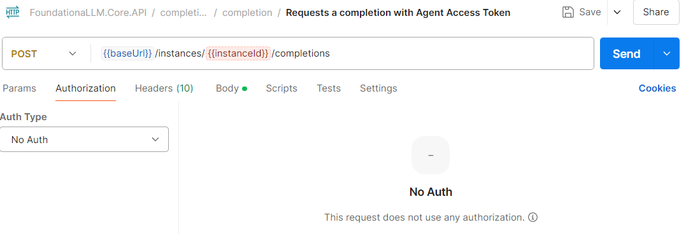

2- On the Headers tab, set a new key **X-AGENT-ACCESS-TOKEN** with the value of the Access Token that you were asked to save or copy previously

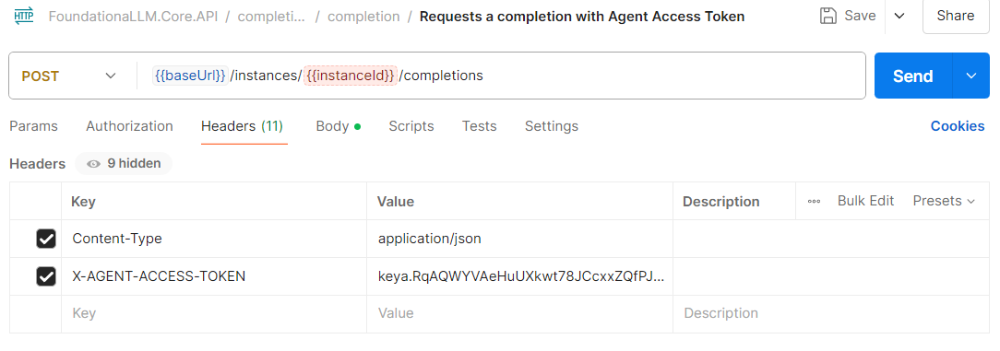

3- On the Body tab, enter the **sessionId** received in the previous POST in the **sessionId** key in raw JSON format

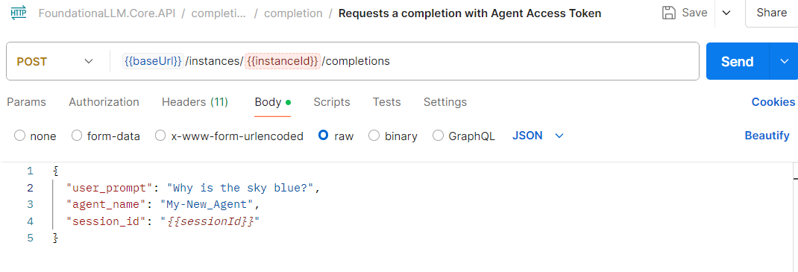

4- Click on the **Send** button to send the request and receive a response from the agent explaining why the sky is blue.
