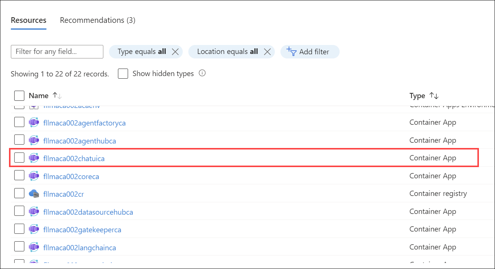
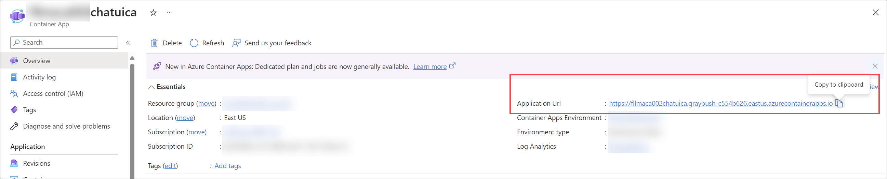
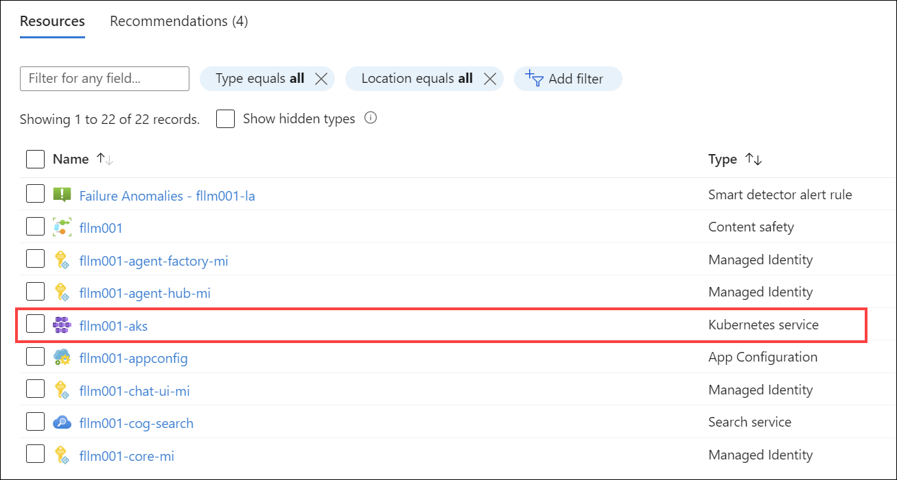
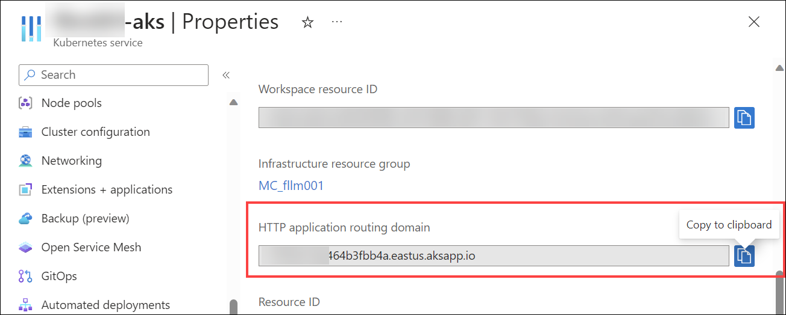
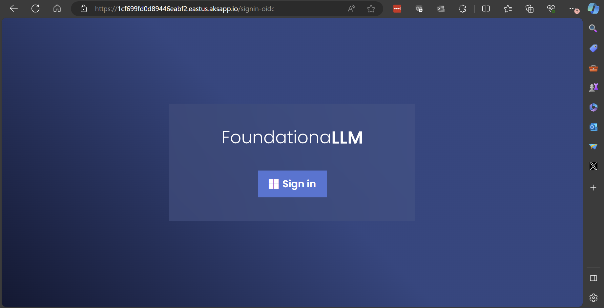
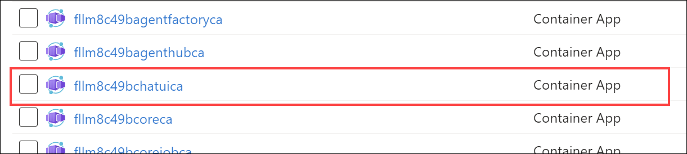
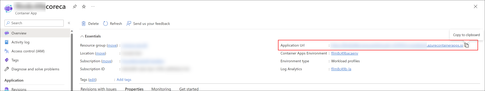

# Quickstart guide

After [deploying](../deployment/index.md) Foundationa**LLM**, complete the following steps to get started:

1. Configure your deployment's [authentication](../deployment/authentication/index.md) settings.
2. Setup your [agents](agents/index.md) to define a persona and connect to your data sources to generate responses.
3. Find your User Portal URL and log in to start using Foundationa**LLM**.

## Find your User Portal (chat UI) URL

If you performed an **Azure Container Apps (ACA)** deployment, follow these steps to obtain the URL for the chat UI application:

1. Within the Resource Group that was created as part of the deployment, select the **Container App** resource whose name ends with `chatuica`.

    

2. Within the Overview pane, copy the **Application Url** value. This is the URL for the chat application.

    

If you performed an **Azure Kubernetes Service (AKS)** deployment, follow these steps to obtain the URL for the chat UI application:

1. Within the Resource Group that was created as part of the deployment, select the **Kubernetes Service** resource.

    

2. Select **Properties** in the left-hand menu and copy the **HTTP application routing domain** value. This is the URL for the chat application.

    

When you navigate to the chat UI application, you will be prompted to log in.

## Find your Core API URL

If you performed an **Azure Container Apps (ACA)** deployment, follow these steps to obtain the URL for the Core API:

1. Within the Resource Group that was created as part of the deployment, select the **Container App** resource whose name ends with `coreca`.

    

2. Within the Overview pane, copy the **Application Url** value. This is the URL for the Core API.

    

If you performed an **Azure Kubernetes Service (AKS)** deployment, follow these steps to obtain the URL for the chat UI application:

1. Within the Resource Group that was created as part of the deployment, select the **Kubernetes Service** resource.

    

2. Select **Properties** in the left-hand menu and copy the **HTTP application routing domain** value. This is the URL for the chat application.

    

    Your Core API URL (for your AKS deployment) is the URL you just copied with `/core` appended to the end of it. For example, if your Core API URL is `https://1cf699fd0d89446eabf2.eastus.aksapp.io/`, then your Core API URL is `https://1cf699fd0d89446eabf2.eastus.aksapp.io/core`.
